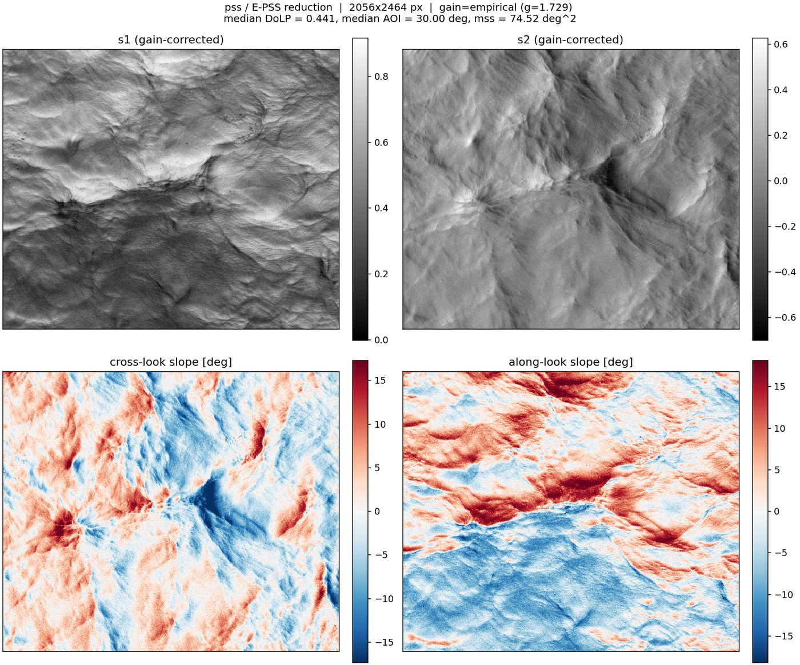
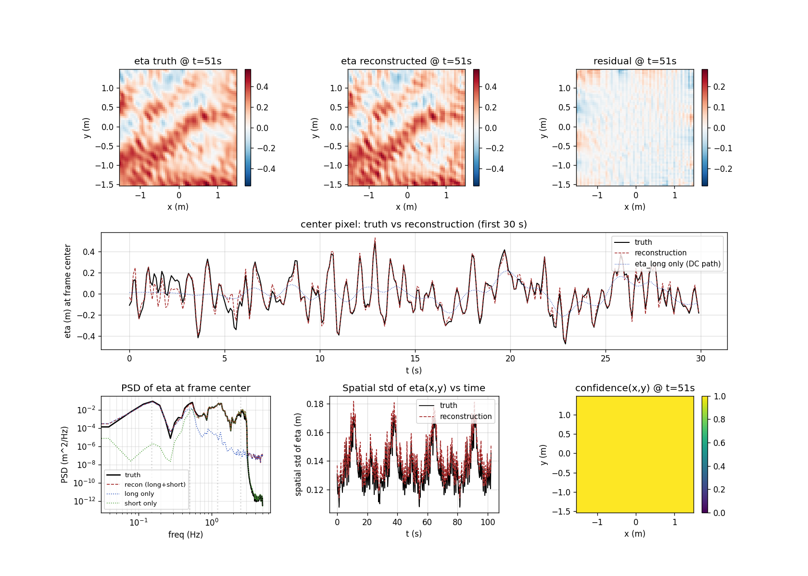

# (Extended) Polarimetric Slope Sensing

**An open framework for measuring ocean surface waves with a single polarimetric camera, implemented in Python.** Given raw frames from a surface-viewing division-of-focal-plane (DoFP) polarimetric camera, these packages produce calibrated two-component surface-slope fields. From a time series of those fields, the framework infers the full surface-elevation field η(x, y, t) across the imager footprint, resolving structure down to gravity-capillary scales.

This is an implementation of the Polarimetric Slope Sensing technique (Zappa _et al._, 2008) and the Extended Polarimetric Slope Sensing (E-PSS) technique (Laxague _et al._, 2026). As the names imply, the Extended method builds on the base one. Strictly speaking, PSS provides a pathway for measuring the two-component surface slope field from a single set of Stokes vector observations. Extended Polarimetric Slope Sensing extends the original technique with two major capabilities:

- in-scene correction for _a priori_ unknown ambient/upwelling illumination
- inference of the long wave (scales greater than the imager FOV) surface elevation from small-amplitude wave theory

In the present implementation, these capabilities are split between two sibling packages, which may be used together or independently:

- **`pss`** — Polarimetric Slope Sensing with E-PSS empirical gain. Python port of the MATLAB demo driver in `_original_routines_MATLAB`. Given a single raw frame (or a series of frames) from a division-of-focal-plane (DoFP) polarimetric camera, this framework recovers along-look/cross-look surface slope fields.

- **`eta_field_recon`** — Surface-elevation η(x, y, t) reconstruction. Given a time-series stack of 2-D slope fields (the output of `pss`, or of any other slope-imaging modality), recovers the elevation field over the entire imager footprint by combining per-frame Harker-O'Leary spatial integration (short-wave shape) with a wavelet-based temporal inversion of the spatial-mean slope (long-wave time series).

The two packages share a repository and a single distribution (one install brings both in), but are imported independently and operate on different scales: `pss` is per-frame, `eta_field_recon` is per-record. The natural workflow is

```
frame stack -> pss.compute_slope_field (per frame) -> slope_x_field, slope_y_field
            -> eta_field_recon.reconstruct_eta_field (over the record) -> eta(x,y,t)
```

Each can also be used standalone.

## Top-level API — `run_epss`, `run_epss_from_slopes`, `reconstruct_eta_from_record`

Three convenience entry points tie the whole chain together. `run_epss` and `run_epss_from_slopes` operate on in-memory arrays; `reconstruct_eta_from_record` is the on-disk (NetCDF) equivalent.

### `epss.run_epss` — raw DoFP frames in

`run_epss` takes an array of raw DoFP frames and runs as far up the processing chain as the supplied inputs allow; each stage is enabled by its optional arguments.

**Tier 0 — slope fields only (bare minimum).** Pass just the frames:

```python
import numpy as np
from epss import run_epss

# frames: (T, H, W) raw DoFP stack (or a single (H, W) frame)
res = run_epss(frames)
res.slope_x, res.slope_y          # (T, Ny, Nx) slope stack (tan of tilt)
res.gain_mode                     # "none"
res.eta_ran                       # False
```

**Tier 1 — empirical DoLP gain.** The empirical gain needs the mean incidence angle `theta_i_mean_deg` plus a flat-on-average reference DoLP. There are two ways to supply that reference:

```python
# (a) An explicit mean/median background frame -> empirical gain at ANY record
#     length. fs is NOT needed here.
res = run_epss(
    frames,
    theta_i_mean_deg=30.0,
    gain_reference_frame=median_frame,   # your temporal-median background
)

# (b) No reference frame, but a long-enough record (>= 30 s by default): the
#     temporal median is formed FROM the stack automatically. This branch
#     needs fs to convert frame count to seconds.
res = run_epss(
    frames,                       # e.g. 300 frames @ 10 Hz = 30 s
    theta_i_mean_deg=30.0,
    fs=10.0,
)
res.gain_mode                     # "empirical"
res.gain_auto_median              # True for (b), False for (a)
```

The 30 s floor is overridable with `min_gain_seconds=...`. If neither a reference frame nor a long-enough record is available, no gain is applied — a single frame is never self-referenced (see *The three gain modes* below).

**Tier 2 — full η(x, y, t) reconstruction (static platform).** Add the imaging geometry. The η stage runs orthorectification and the elevation inversion:

```python
res = run_epss(
    frames,
    fs=10.0,                      # frame rate (Hz)
    theta_i_mean_deg=30.0,        # mean incidence angle (deg)
    freeboard_m=23.0,             # camera height above the surface (m)
    pixel_pitch_m=3.45e-6,        # sensor pixel pitch (m)
    focal_length_m=0.075,         # lens focal length (m)
    water_depth_m=15.0,           # optional
    aperture_diameter_m=1.2,      # optional: circular slope-averaging aperture
    downsample=8,
)
res.eta_xyt, res.eta_long, res.eta_short, res.confidence   # elevation fields
res.ortho.dx_m                    # the true ground dx, derived from the optics
```

The three *geometry* parameters (`freeboard_m`, `pixel_pitch_m`, `focal_length_m`) are **all-or-nothing**: pass one without the others and it raises an error. The η stage needs those three **plus** `theta_i_mean_deg` **plus** `fs`. By contrast `theta_i_mean_deg` and `fs` may each be supplied on their own (they enable the Tier-1 gain path), so they are deliberately *not* part of the all-or-nothing geometry set. The long-wave (mean-wave) inversion is itself gated on record length — see below.

| You provide | You get |
|---|---|
| frames | slope fields |
| + `theta_i_mean_deg` + reference frame | + empirical gain (any length) |
| + `theta_i_mean_deg` + `fs`, record ≥ `min_gain_seconds` | + empirical gain (auto median) |
| + `theta_i_mean_deg` + `fs` + geometry trio | + orthorectification + η(x, y, t) |

### `epss.run_epss_from_slopes` — orthorectified slopes in (moving platform)

If you computed slope fields from a **moving platform** and orthorectified them yourself onto a uniform ground grid, there is nothing left for `pss` to reduce and nothing for the static orthorectifier to do. `run_epss_from_slopes` skips straight to the elevation inversion:

```python
from epss import run_epss_from_slopes

res = run_epss_from_slopes(
    slope_x, slope_y,             # (T, Ny, Nx), tan of tilt, dimensionless
    dx_m=0.05,                    # the uniform ground pixel size you set
    fs=10.0,                      # frame rate (Hz)
    aperture_diameter_m=1.2,      # optional
)
res.eta_xyt, res.eta_long, res.long_wave_ran
```

The slope convention is the same one `pss` emits and `reconstruct_eta_field` consumes: `slope_x`/`slope_y` are the **dimensionless** surface slopes (tan of the tilt), not tilt angles in degrees or radians. Gain does not apply on this path (`res.gain_mode is None`) — the gain is a raw→slope concern and your slopes already exist. The long-wave length gate still applies.

### `eta_field_recon.reconstruct_eta_from_record` — NetCDF record in

The same chain as `run_epss`, but starting from a NetCDF record on disk rather than an in-memory array. It reads the acquisition geometry from the file, so with `orthorectify=True` the ground `dx` is derived automatically:

```python
from eta_field_recon import reconstruct_eta_from_record

res = reconstruct_eta_from_record(
    "my_record.nc",
    orthorectify=True,                       # derive dx from the file's optics
    gain_reference_path="my_median.nc",      # empirical-gain reference
    aperture_diameter_m=1.2,                 # optional
    downsample=8,
)
res.eta_xyt, res.eta_long, res.long_wave_ran, res.ortho.dx_m
```

### Static orthorectification and the platform-motion caveat

Orthorectification here is the **static-platform** case only: it projects the obliquely-viewed slope field onto a uniform ground grid using fixed geometry (freeboard, θᵢ, focal length, pixel pitch), correcting the oblique-view trapezoid and yielding the uniform ground `dx` the η inversion requires. It assumes the camera pose is constant over the record. The moving-platform case (per-frame attitude-driven rectification) needs a per-frame motion source (IMU/INS) and is **not** implemented; see the TODO in `eta_pipeline.py`.

Note that `pss` does **not** subtract the per-frame spatial mean of the slopes. The spatial-mean slope is the swell-induced tilt of the whole footprint — the long-wave signal `eta_long(t)` is reconstructed from it — so per-frame removal would destroy the quantity the long-wave inversion needs. The genuinely constant part, the camera's fixed viewing tilt, is instead removed once at the **record** level inside `eta_field_recon` (it subtracts the time-mean of the spatial-mean slope before the long-wave inversion). The short-wave path is unaffected either way, since its spatial integration discards the per-frame mean by construction. Orthorectification is therefore purely the geometric pixel resample — it does not re-rotate the slope vectors.

For a record, the expensive part of orthorectification — the Delaunay triangulation of the (~10⁶) input points — depends only on the fixed geometry, so it is built **once** via `build_ortho_plan()` and reused for every frame (`orthorectify_static(..., plan=plan)`). This makes per-frame rectification a cheap barycentric resample rather than a per-frame triangulation rebuild (~100×+ faster over a long record). Likewise the NetCDF reader slices one frame off disk at a time, so processing an N-frame stack never materializes more than a single frame in memory.

### Record-length gate on the long-wave inversion

The long-wave path (the mean-wave elevation time series `eta_long(t)`) requires the record to span enough time to resolve the lowest wave frequency. The gate is physics-based: the record must cover at least `min_periods` periods of the lowest CWT frequency (default 0.5 periods of 0.05 Hz, i.e. ~10 s). Shorter records skip the long-wave inversion entirely (`eta_long = 0`, `eta_xyt = eta_short`) and save the CWT cost. Override with `force_long_wave`.

## pss — Quick start

```bash
git clone https://github.com/unh-cassll/polarimetric-slope-sensing.git
cd polarimetric-slope-sensing
pip install -e .
python _examples/load_and_reduce.py            # reduces the bundled example frame
```

…produces a 2×2 panel showing the gain-corrected Stokes components and the along-look / cross-look slope fields, reproducing the canonical example:



The bundled example reduces a single raw frame (resolved by `_data.frame_path()`, Zenodo name `asit_2019_raw_pol_frame0001.nc`) using the E-PSS workflow: the empirical gain is calibrated against the temporal-median background frame (`_data.median_path()`, `asit_2019_raw_pol_median.nc`), never against the frame itself. Run it with the dedicated script:

```bash
python _examples/load_and_reduce_with_median_gain.py
```

Reduction summary (printed to stdout, default native reduction, median-referenced empirical gain):

    resolution      : native (half-res, one Stokes vector per super-pixel)
    gain mode       : empirical (g = 1.5587, ref = temporal-median frame)
    median DoLP     : 0.3309
    median AOI      : 26.099 deg
    mss             : 0.022729  (dimensionless, var(Sx) + var(Sy))

The empirical gain is calibrated against a **temporal average**, not the individual frame. Its `median(DoLP) → DoLP_ideal(θᵢ)` step assumes the reference's median surface tilt equals the mean viewing angle — i.e. a flat surface *on average*. That holds for a temporal median (waves average out to flat) but is false for any single instantaneous frame, so the frame keeps its true DoLP departure from the background instead of being forced onto the Fresnel ideal. If no reference is supplied, **no gain is applied** (the correction is never self-referenced).

By default the reduction is **native** resolution: one Stokes vector per 2×2 super-pixel, returned at half the frame size (e.g. 1028×1232 from a 2056×2464 sensor). The output grid then matches the measurement grid, with no interpolation implying detail the sensor did not resolve. Pass `resolution="full"` to interpolate back to the full frame size with a chosen `method` (see below).

The s1 and s2 panels show the gain-corrected normalized Stokes components; the diverging-colormap panels show the orthogonal decomposition of surface tilt into the camera's along-look (toward the wave-coming-from direction in this geometry) and cross-look axes. Individual wave faces, crests, and gravity-capillary structure down to ~1 mm scale are clearly resolved.

For a step-by-step visual walkthrough of the whole chain — raw frame → orientation sub-images → Stokes parameters → DoLP/orientation → angle of incidence → slope fields, plus a Fresnel-curve visualization of the empirical gain — open the notebook **[`PSS_walkthrough.ipynb`](PSS_walkthrough.ipynb)**

## eta_field_recon — Quick start

```bash
python eta_field_recon/demo_eta_field.py
```

…synthesizes a 4-component wave field (long swell + wind sea + capillary waves) at 256×256 × 1024 frames, runs the reconstruction, and produces a diagnostic plot. Takes ~2 minutes (most of it is synthesis).



Demo reconstruction quality on this 4-mode synthetic field:

    center time series RMSE       : 0.040 m (truth std = 0.18 m)
    center time series correlation: +0.975
    confidence-weighted RMSE      : 0.028 m
    confidence-weighted correlation: +0.988
    full-field RMSE               : 0.045 m
    full-field correlation        : +0.963

See [`eta_field_recon/README.md`](eta_field_recon/README.md) for the package-level API reference and a fuller description of the method.

## Input data (for the pss layer)

`pss` reads raw DoFP frames from annotated NetCDF-4 files (CF-1.10 + ACDD-1.3). Each file carries the acquisition geometry (θᵢ, n_water, super-pixel layout, frame rate, etc.) as variables/attributes, so a single file fully specifies how to reduce itself — `read_netcdf_frame` reads those back and `compute_slope_field` consumes them. The reader handles both a plain 2-D `(y, x)` frame and the stack schema (`raw_frame` with a leading `time` dimension), selecting a frame with `time_index=` and reorienting as needed.

The example data live in a Zenodo archive (CC-BY-4.0, DOI [10.5281/zenodo.20361229](https://doi.org/10.5281/zenodo.20361229)) and are **downloaded on first use**, not committed to the repository. `_data/__init__.py` resolves each file locally if cached, else fetches it from Zenodo and verifies its md5 against the published checksum. The record holds four files:

| file                              | what it is                                  | size    |
|-----------------------------------|---------------------------------------------|---------|
| `asit_2019_raw_pol_frame0001.nc`  | first frame of the record                   | 5.6 MB  |
| `asit_2019_raw_pol_median.nc`     | temporal-median frame (empirical-gain ref)  | 4.9 MB  |
| `asit_2019_raw_pol_stack_3s.nc`   | first 3 s of the record                     | 505 MB  |
| `asit_2019_raw_pol_stack.nc`      | full 60 s @ 30 fps                          | 10.1 GB |

```python
import _data
frame  = _data.frame_path()       # downloads + caches on first call
median = _data.median_path()
stack3 = _data.stack_3s_path()    # 505 MB
full   = _data.stack_full_path()  # 10.1 GB
```

The one data file that **is** committed is a small derived artifact, `_data/asit2019_mean_slope_60s.nc` (a few KB): the spatial-mean slope time series `sx_mean(t)`, `sy_mean(t)` for the full 60 s record, produced once by `_tools/precompute_mean_wave.py`. It lets `_data.mean_wave_timeseries()` reconstruct the mean-wave elevation `eta_long(t)` live and offline, without the 10 GB download:

```python
t, eta_long = _data.mean_wave_timeseries()   # offline; uses the committed series
```

A second small committed artifact, `_data/asit2019_lidar_elevation_10min.nc` (~105 KB), holds the independent validation ground truth: a 10-minute (6000-sample, 10 Hz) water-surface-elevation series from a Riegl LD90-3 laser altimeter. It loads via `_data.lidar_elevation()`:

```python
t_lidar, elev = _data.lidar_elevation()      # Riegl LD90-3 elevation (m)
```

The lidar and the PSS imager start together but view spatially offset points, so a propagation lag between the two is expected (the file records this in its `timing_note`; cross-correlation measures it rather than assuming alignment).

Because the raw data are not committed, the test suite resolves them **local-only** (no network) and **skips** the data-dependent tests when the files have not been cached — so the suite stays green offline (e.g. in CI), and runs the full numerical regressions once the data are present.

## Repository layout

```
polarimetric-slope-sensing/
├── epss.py                               run_epss() top-level entry point
├── pss/                                  Polarimetric Slope Sensing package
│   ├── __init__.py
│   ├── stokes.py                         3 Stokes methods (Ratliff M4 default)
│   ├── gain.py                           none / lab / empirical DoLP gain
│   ├── fresnel.py                        DoLP <-> θᵢ lookup (Fresnel inversion)
│   ├── slope.py                          end-to-end pipeline
│   ├── io.py                             NetCDF reader (2-D and time-stack schemas)
│   └── _cli.py                           console-script bridge
├── eta_field_recon/                      η(x, y, t) reconstruction package
│   ├── __init__.py
│   ├── recon.py                          reconstruct_eta_field() (long_wave switch)
│   ├── eta_pipeline.py                   reconstruct_eta_from_record() field-data driver
│   ├── orthorectify.py                   orthorectify_static() ground-grid projection
│   ├── wavelet_core.py                   CWT + Fresnel-corrected dispersion
│   ├── demo_eta_field.py                 synthetic-field validation demo
│   ├── demo_eta_field.png                rendered demo output
│   └── README.md                         package-specific quick reference
├── _examples/
│   ├── load_and_reduce.py                pss demo (single frame; optional --median)
│   └── load_and_reduce_with_median_gain.py  E-PSS median-referenced gain demo
├── _data/                               example data + Zenodo resolver package
│   ├── __init__.py                       Zenodo resolver (download + md5);
│   │                                     mean_wave_timeseries() + lidar_elevation()
│   ├── asit2019_mean_slope_60s.nc        committed: spatial-mean slope series (few KB)
│   └── asit2019_lidar_elevation_10min.nc committed: Riegl LD90-3 elevation (~105 KB)
├── _figures/
│   ├── example_output.jpg                rendered output of the pss demo
│   └── validation_eta_long_vs_lidar.png  eta_long vs lidar validation figure
├── _tools/
│   ├── precompute_mean_wave.py           one-off: build the committed mean-slope series
│   └── validate_eta_long_vs_lidar.py     cross-correlate eta_long vs lidar (lag + figure)
├── _tests/                               pytest suite
│   ├── conftest.py
│   ├── test_stokes.py
│   ├── test_gain.py
│   ├── test_fresnel.py
│   ├── test_pipeline.py                  synthetic + NetCDF end-to-end
│   ├── test_median_gain.py               stack reader + median-referenced gain
│   └── test_eta_field_recon.py
├── _original_routines_MATLAB/            original MATLAB routines (archived)
├── PSS_walkthrough.ipynb                 visual walkthrough notebook (grayscale)
├── pyproject.toml
├── requirements.txt                      (kept for non-pip workflows)
├── LICENSE                               GPL-3.0-or-later
└── README.md
```

The raw NetCDF files are **not** committed — they download from Zenodo on first use and cache in `_data/` (md5-verified), so `_data/*.nc` is `.gitignore`'d. Two small derived artifacts are force-included in git as exceptions: `asit2019_mean_slope_60s.nc` (the spatial-mean slope series) and `asit2019_lidar_elevation_10min.nc` (the Riegl lidar validation series); see the Input-data section.

## Install

Python 3.10+. The installable Python project lives at the repository root.

**Straight from GitHub (no clone needed):**

```bash
pip install "git+https://github.com/unh-cassll/polarimetric-slope-sensing.git"
```

The import name is `pss` even though the distribution is named `epss`:

```python
import pss
from pss import compute_slope_field
```

**For development (editable), after cloning:**

```bash
git clone https://github.com/unh-cassll/polarimetric-slope-sensing.git
cd polarimetric-slope-sensing
pip install -e .                       # editable install + core dependencies
pip install -e ".[test]"               # add pytest + xarray for the test suite
pip install -e ".[all]"                # everything
```

(On a PEP-668 "externally managed" Python, add `--break-system-packages` to the `pip install` lines, or use a virtual environment.)

Core dependencies are `numpy`, `scipy`, `matplotlib`, and `netCDF4`. If you prefer not to install the package, dependencies can be pulled from `requirements.txt` and the scripts can be run in-place (`python _examples/load_and_reduce.py ...`).

After `pip install -e .`, three console scripts are available on `$PATH`:

| command                   | source                                      |
|---------------------------|---------------------------------------------|
| `pss-load-reduce`         | `_examples/load_and_reduce.py`               |
| `pss-load-reduce-median`  | `_examples/load_and_reduce_with_median_gain.py` |
| `pss-eta-demo`            | `eta_field_recon/demo_eta_field.py`         |

## Running the tests

```bash
pip install -e ".[test]"
pytest
```

The suite runs offline: tests that need the large Zenodo files are skipped automatically when those files have not been cached locally (so it stays green in CI), and the full numerical regressions run once the example data are present.

The test suite covers all three Stokes methods, all three gain modes (including the median-referenced empirical gain), the Fresnel-inversion lookup, the NetCDF reader (both 2-D and time-stack schemas), exact reproduction of the documented `pss` reduction numbers, and (for `eta_field_recon`) the dispersion-relation accuracy, shape/return-type contracts, the orthogonal-decomposition invariant, and single-mode synthetic-field correlation with truth.

## The three gain modes

The MATLAB original applies hard-coded lab-calibrated scalars (S1×1.2185, S2×1.2197) to correct for the difference between the polarimeter's measured DoLP and the ideal Fresnel response. `pss` replaces those with a `gain_mode` argument:

| `gain_mode`   | Behavior                                                                       |
|---------------|--------------------------------------------------------------------------------|
| `"none"`      | No correction — raw polarimeter response                                       |
| `"lab"`       | Fixed lab-calibrated gain (defaults to the MATLAB values; overridable)         |
| `"empirical"` | Scales a temporal-median reference DoLP to the Fresnel ideal at θᵢ (no reference → no gain) |

The empirical gain is computed as

    g = DoLP_ideal(θᵢ) / median(DoLP_reference)

where `DoLP_ideal(θᵢ)` is the Fresnel prediction for unpolarized sky and no upwelling radiance at the camera's mean angle of incidence. Both normalized Stokes components are scaled by `g`. Field values reported in the E-PSS paper for ASIT2019 are in the range 1.2–1.7; the implementation clips at `[0.5, 3.0]` by default to reject values outside the physically plausible range.

`median(DoLP_reference)` is **always** taken from a temporal average, never from the frame being corrected. The `median(DoLP) → DoLP_ideal(θᵢ)` step assumes the reference's median surface tilt equals the mean viewing angle (a flat surface on average) — true for a temporal median, false for a single instantaneous frame. So self-referencing is not supported. Supply the reference one of two ways:

- `gain_reference_frame=` to `compute_slope_field` — a per-pixel temporal-median background frame (the canonical E-PSS workflow); or
- `dolp_obs_median=` (a precomputed reference DoLP scalar) to `apply_gain`, for the single-frame case where a temporal median can't be formed.

If both are given, the reference frame takes precedence. **If neither is supplied, no gain is applied** (the result is downgraded to `gain_mode="none"` with an explanatory note) — the gain is never silently self-referenced.

## Library use

The simplest end-to-end call reads a frame and its metadata from NetCDF, so the reduction parameters come straight from the file:

```python
from pss import read_netcdf_frame, apply_layout_from_meta, compute_slope_field

frame, meta = read_netcdf_frame(_data.frame_path())  # Zenodo: asit_2019_raw_pol_frame0001.nc
apply_layout_from_meta(meta)   # honor the file's super-pixel layout

result = compute_slope_field(
    frame,
    # resolution defaults to "native" (half-res, one Stokes vector per
    # super-pixel). Pass resolution="full" to interpolate with `method`.
    gain_mode=meta.gain_mode,      # "none" / "lab" / "empirical"
    theta_i_mean_deg=meta.theta_i_mean_deg,
    n_water=meta.n_water,
)

print(result.mss, result.gain_notes)
# result.s1, .s2, .dolp, .aoi_deg, .Sx, .Sy, .Ax_deg, .Ay_deg are 2-D arrays
# (at native resolution these are H/2 x W/2).
```

For a full-resolution interpolated reduction, choose a `method`:

```python
result = compute_slope_field(
    frame, resolution="full",
    method="bilinear",   # or "kernel_averaging" / "conv_demodulation" (Ratliff M4)
    gain_mode="empirical",
    theta_i_mean_deg=meta.theta_i_mean_deg, n_water=meta.n_water,
)
```

For the E-PSS workflow, derive the empirical gain from the temporal-median background frame and apply it to an individual frame:

```python
frame,  meta = read_netcdf_frame(_data.frame_path())    # asit_2019_raw_pol_frame0001.nc
median, _    = read_netcdf_frame(_data.median_path())    # asit_2019_raw_pol_median.nc
apply_layout_from_meta(meta)

result = compute_slope_field(
    frame,
    # resolution defaults to "native"; add resolution="full", method=... to interpolate.
    gain_mode="empirical",
    theta_i_mean_deg=meta.theta_i_mean_deg,
    n_water=meta.n_water,
    gain_reference_frame=median,   # gain calibrated against the median, not the frame
)
```

## CLI

**`_examples/load_and_reduce.py`** — reduces a single frame. Reads metadata from the file and runs with the file's suggested defaults; CLI flags override any metadata-supplied parameter. With no arguments it reduces the bundled example frame.

```bash
# Bundled example frame (no --median -> no empirical gain applied)
python _examples/load_and_reduce.py

# A specific file, picking a frame along the time axis
python _examples/load_and_reduce.py my_record.nc --time-index 12

# Calibrate the empirical gain against a median frame; save the figure
python _examples/load_and_reduce.py --median my_median.nc \
    --save out.png --no-show

# Different Stokes method / lab gain
python _examples/load_and_reduce.py --method kernel_averaging --gain lab
```

**`_examples/load_and_reduce_with_median_gain.py`** — dedicated E-PSS demo: reduce a frame with the empirical gain calibrated against a temporal-median background frame. With no arguments it uses the two bundled example files.

```bash
python _examples/load_and_reduce_with_median_gain.py
python _examples/load_and_reduce_with_median_gain.py my_frame.nc \
    --median my_median.nc --save out.png --no-show
```

## NetCDF schema (archival)

`pss` reads CF-1.10 + ACDD-1.3 NetCDF-4 files. The reader expects:

- a `raw_frame` variable — either 2-D `(y, x)` or a stack `(time, x, y)`; the reader selects a frame with `time_index=` and reorients to `(y, x)` from the declared dimension names;
- a `superpixel_layout` 2×2 array giving the angle→position mapping, so the super-pixel arrangement is unambiguous (read back via the metadata and applied with `apply_layout_from_meta`);
- scalar geometry variables (θᵢ, n_water, lens, pixel pitch, azimuth, freeboard, frame rate, exposure, position, wind);
- CF discovery attributes (title, keywords, creator, license, geospatial bounds) and `pss_processing_*` hints that tell `read_netcdf_frame` how to reduce the frame.

Files in this schema (and longer time series) are produced by the acquisition pipeline and distributed via a Zenodo archive (DOI [10.5281/zenodo.20361229](https://doi.org/10.5281/zenodo.20361229)). The bundled frame reduces (default native resolution, median-referenced empirical gain against the temporal-median frame) to `g = 1.5587`, `median DoLP = 0.3309`, `median AOI = 26.099°`, `mss = 0.022729` (dimensionless).

## Super-pixel layout — why it matters and how to verify

A DoFP sensor tiles four micropolarizers (at 0°, 45°, 90°, 135°) into each 2×2 super-pixel. The exact assignment of angle to (row, column) position is sensor-specific and matters: getting it wrong rotates the inferred polarization orientation φ by a multiple of 45°, and a 180° rotation inverts the slope sign in a way that adds super-pixel-scale checkerboard noise (visible as a ~10× jump in `mss`).

The default in `pss.stokes._OFFSETS` is:

```
(row=0, col=0) -> 90°
(row=0, col=1) -> 45°
(row=1, col=0) -> 135°
(row=1, col=1) ->  0°
```

This is the **L0** layout used by the Sony IMX250MZR. To verify on a new sensor:

1. Reduce a frame with all four 90°-rotated layouts.
2. Plot the DoLP-weighted histogram of φ for each.
3. The 180° rotation produces dramatically higher `mss`; rule it out.
4. The other three differ by exactly 45° shifts in the φ peak.
5. The correct layout is the one whose φ peak aligns with what you expect for the wave field — typically the camera's horizontal or vertical axis, depending on mounting.

The NetCDF file stores the verified layout in the `superpixel_layout` variable (as a 2×2 array of angles in degrees), and `read_netcdf_frame` returns it in the metadata so downstream code can patch the package default if needed (`apply_layout_from_meta`).

## eta_field_recon — elevation reconstruction from a slope-image time series

The `eta_field_recon` package lifts a stack of 2-D slope images to the elevation field η(x, y, t). The natural input is the output of `pss` applied frame-by-frame to a NetCDF frame stack, but any slope-imaging modality works (stereo, refractive shape-from-stereo, etc.) so long as you can hand it `(slope_x, slope_y)` per frame.

### Library use

```python
from eta_field_recon import reconstruct_eta_field

# slope_x_field, slope_y_field: (T, Ny, Nx) float arrays, slope in radians
eta_xyt, eta_long, eta_short, conf, diag = reconstruct_eta_field(
    slope_x_field, slope_y_field,
    dx=0.006,              # pixel size in meters
    fs=10.0,               # frame rate in Hz
    water_depth_m=15.0,    # for the dispersion relation
    downsample=8,          # output is (T, Ny/8, Nx/8)
)
```

Returns:
- `eta_xyt` — `(T, Ny_d, Nx_d)` elevation field (m)
- `eta_long` — `(T,)` long-wave (spatial-mean) time series (m)
- `eta_short` — `(T, Ny_d, Nx_d)` zero-mean-per-frame short-wave field (m)
- `conf` — `(T, Ny_d, Nx_d)` confidence mask on `[0, 1]`
- `diag` — dict of intermediates (CWT coefficients, windows, the directional-spread moment `r2`, the `hs_spread_factor` Hₛ correction, etc.)

### Method, briefly

Two paths, summed:

1. **Short-wave path** (per-frame Harker-O'Leary least-squares spatial integration via `pyGrad2Surf.g2s`). Recovers the wave SHAPE inside the frame; sets the spatial mean to zero per frame by construction.

2. **Long-wave path** (continuous-wavelet transform of the spatial-mean slope, Krogstad signed-direction estimator per `(f, t)`, dispersion-relation projection, inverse CWT). Recovers the elevation time series the spatial integration loses.

The two paths are orthogonal — short has zero spatial mean, long has no spatial structure inside the frame — and sum cleanly. For a frame of size L, the crossover frequency where wavelength = L is `f_crossover = √(g / 2πL) ≈ 0.7 Hz at L = 3 m`. Above that, the short path dominates; below it, the long path dominates.

See [`eta_field_recon/README.md`](eta_field_recon/README.md) for the API reference and the full method derivation. The implementation is deliberately modular, so natural extension points (anti-aliasing, an MEM/MLM directional estimator, current correction, streaming for long records) are easy to slot in.

### Long-wave inversion: calibration and robustness

The long-wave path carries guards so its sign and amplitude hold across configurations, not just the defaults:

- **Signed amplitude calibration.** The per-frequency reconstruction gain is fit by signed projection, and the Torrence-Compo `cdelta` constant (which `ewdm` tabulates only for `Morlet(6)`) is sanitized, so the surface reconstructs *upright* for any mother wavelet ω₀. Without this, a non-default ω₀ inverts `eta(t)` while leaving the spectrum and Hₛ unchanged.
- **Cone-of-influence guard.** A frequency band whose wavelet e-folding time exceeds a fraction of the record (or whose calibration gain falls out of range) comes back as `NaN` with a warning and is dropped from the inverse, rather than being silently clamped to a plausible-looking value.
- **Band-locked direction sign.** Where one slope channel carries the whole wave (a swell along the look axis, ~90°/270°), the per-`(f, t)` propagation sign is set by noise; locking it to the band-dominant direction — chosen per frequency by phase coherence, so opposing systems at different frequencies keep their own directions — removes the ~20% Hₛ dip that otherwise appears on those headings while leaving off-axis seas untouched.
- **Directional-spreading correction.** The single-direction projection discards off-axis variance, so Hₛ runs low for broad seas. The second directional moment `r2` and a spread-dependent correction factor are reported in `diag` (`directional_spread`, `spread_hs_factor`); applying the factor brings Hₛ to within ~3% of truth across typical spreads, mother-agnostically.
- **Opposing-current dispersion.** Under a strong opposing current the dispersion relation ω(k) becomes non-monotonic (wave blocking); the solver restricts to the physical branch and returns `NaN` above the blocking frequency instead of interpolating across a non-monotonic curve.

### Validation against an independent lidar

The long-wave reconstruction has been checked against an independent near-infrared laser altimeter (Riegl LD90-3) over the same ASIT2019 period. Both instruments share an acquisition start of 2019-10-31 16:00:00 UTC: the lidar runs the full 10 min, while the example PSS record is the 60 s excerpt beginning at frame 7001 — i.e. ~233 s into the acquisition at 30 fps. `_tools/validate_eta_long_vs_lidar.py` reconstructs `eta_long(t)` from the committed slope series and cross-correlates it against the lidar (band-limited to 0.05–0.5 Hz), anchored at that ~233 s offset. The lidar spot and the PSS footprint are ~20 m apart, so the same swell reaches them a few seconds apart; at the deep-water celerity near the 0.17 Hz peak (`c = g/2πf ≈ 8.8 m/s`) that is a ~2 s lag, and the measured propagation lag is ~2.4 s, consistent with the geometry. Over the 60 s window the waveform correlation is r ≈ 0.75 (band-passed std 36 cm vs 45 cm), and the elevation spectra overlap through the energetic wave band (matched peak near 0.17 Hz). This comparison is sign-sensitive — spectra and Hₘ₀ are blind to a global sign flip — and confirms `eta_long` is up-positive.

A practical note on the wavelet formulation: because the inversion is a CWT band-limited to roughly [0.05, 2] Hz, the `1/k` dispersion division is never evaluated in the `f → 0` (`k → 0`) regime where it would amplify low-frequency slope noise into spurious elevation. The band floor does implicitly what a direct spectral `1/k` inversion needs explicit low-frequency conditioning to achieve — the inferred elevation spectrum shows no low-frequency blow-up relative to the lidar.

### Directional spectrum

The full directional wave spectrum F(f, θ) can be derived from `eta_xyt` together with the slope fields. That estimation is a downstream step and is not part of this package, but the `eta_field_recon` outputs are designed to feed straight into it.

## Relationship to the MATLAB original

`pss` began as a Python port of the original MATLAB demo driver (`sample_slope_field_calculations.m`, archived in this repository under `_original_routines_MATLAB/`), and reproduces its results. The MATLAB driver:

1. loads a DoLP→θᵢ lookup table (`dolp_theta_vecs.mat`), keeps the rising Fresnel branch, and resamples it on a uniform DoLP grid with PCHIP;
2. reads a raw DoFP frame from disk;
3. loops over three Stokes-reconstruction methods;
4. multiplies S1 by 1.2185 and S2 by 1.2197 (hard-coded lab gains);
5. computes DoLP, orientation, AOI, slopes, and a 2×2 plot.

The Python version reproduces all of that and generalizes step 4 into the configurable `gain_mode` (see *The three gain modes*). The lookup table in step 1 is, by default, generated from first-principles Fresnel theory (`pss.fresnel.build_lookup_table`); the original `.mat` table can also be loaded directly via `pss.fresnel.load_lookup_table`.

## Implementation notes

- **Output resolution (`resolution=`).** The default is `"native"`: the four orientation samples in each 2×2 super-pixel are combined directly into one Stokes vector, so the result is half the frame size (H/2 × W/2) with no interpolation. There is one polarization measurement per super-pixel, and the output grid reflects that. The effective pixel pitch is then **twice** the sensor pitch, which matters for any wavelength/spectrum computation (pass the doubled `dx`). Passing `resolution="full"` interpolates each orientation back to the full (H, W) grid using `method`; this implies 2× the real linear resolution but partially corrects the IFOV half-pixel offset between orientations.

- **Bilinear interpolation method** uses `scipy.ndimage.map_coordinates(order=1)` and inverts each orientation's own (row, column) sample positions within the 2×2 super-pixel, registering the four channels onto the common full-frame grid.

- **Conv-demodulation method (`conv_demodulation`) is the package default** and implements the exact **Ratliff, LaCasse & Tyo (2009) Method 4** — the 16-pixel interpolator from Fig. 3 of that paper (radius 3√2/2, four pixels per orientation, distance weights A = 0.3541, B = 0.2639, C = 0.1180). The four 4×4 kernels are convolved with the frame and combined per Eq. (12); the per-parity kernel→orientation mapping is derived from the configured super-pixel layout (`_OFFSETS`) rather than hard-coded, so it tracks the layout. It takes no kernel-size argument. (`kernel_averaging` still accepts `"2x2"`/`"4x4"`.)

- **`mss` definition.** `mss` is the **dimensionless** mean-square slope, `var(Sx) + var(Sy)`, where `Sx`, `Sy` are the surface slopes (tangents of the tilt). This is the standard air-sea quantity. Note this differs from the MATLAB driver, which computed `var(atand(Ax))` — the variance of the tilt *angle* in deg² (and via a double-`atand`). To recover the tilt-angle variance instead, use `var(result.Ax_deg) + var(result.Ay_deg)`; see the comment in `pss/slope.py`.

- **Empirical-gain safety clamp.** The gain is clipped at `[0.5, 3.0]` by default; override via the `clip_gain` argument of `pss.gain.apply_gain`.

## Verifying against MATLAB output

For a like-for-like comparison with the original MATLAB, reduce a frame with the fixed lab gain (the MATLAB original's behavior):

```bash
python _examples/load_and_reduce.py my_frame.nc --method bilinear --gain lab
```

…produces panels visually indistinguishable from MATLAB's figure 1 output, with `mss` values within a few percent (small differences are expected from the bilinear half-pixel handling and, under the default, the Ratliff Method 4 reconstruction).

## Citation

If you use `pss` or `eta_field_recon` in published work, please cite the relevant paper in the E-PSS series:

> Laxague, N. J. M., Z. G. Duvarcı, L. Hogan, J. Liu, C. Bouillon, and
> C. J. Zappa (2026). "E-PSS: the Extended Polarimetric Slope Sensing
> technique for measuring ocean surface waves." *IEEE Journal of Oceanic Engineering.* (in preparation / forthcoming)

## License

GPL-3.0-or-later. See `LICENSE`. This Python implementation is released under the same license as the MATLAB original ([`unh-cassll/polarimetric-slope-sensing`](https://github.com/unh-cassll/polarimetric-slope-sensing)), which is GPL-3.0.
